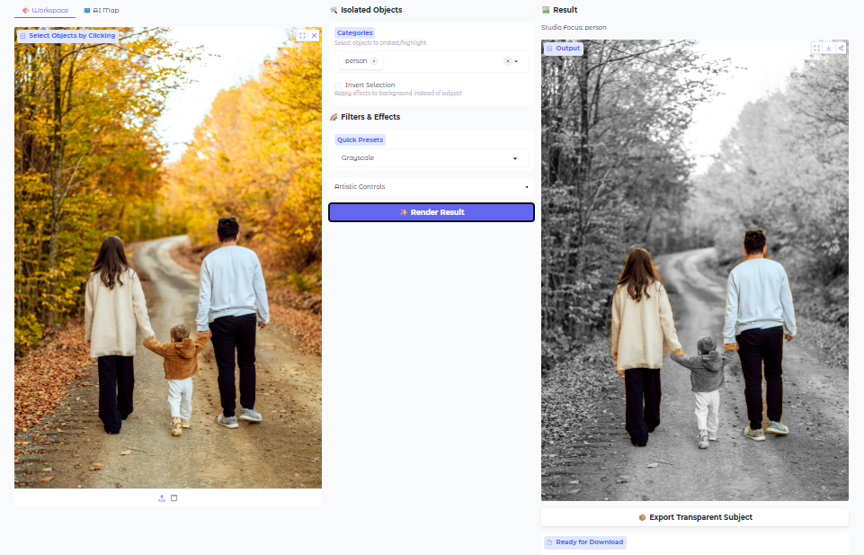

# 🖼️ Image Segmentation Using Transformers


An interactive **image editing and segmentation application** that lets you click on objects in an image, isolate them using semantic segmentation, and apply professional background filters — all directly in your browser.

Built with **Gradio** and **Hugging Face Transformers**, designed for experimentation and creative workflows.

---

## 🖼️ App Demo Screenshot



---

## ✨ Features

* **Object Segmentation:** Automatically detects and segments multiple objects in an image.
* **Click-to-Select:** Click directly on the image to toggle object categories (multi-select supported).
* **Background Filters:**
  * Grayscale
  * Portrait Blur
  * Deep Darken
  * Exposure, contrast, saturation, and edge smoothing controls
* **Invert Selection:** Apply effects to the background instead of the subject.
* **Segmentation Map View:** Visual overlay of all detected object regions.
* **Transparent PNG Export:** Export isolated subjects with alpha transparency.

---

## 🛠️ Tech Stack

* **UI:** Gradio (Blocks)
* **Model:** [`facebook/mask2former-swin-tiny-coco-panoptic`](https://huggingface.co/facebook/mask2former-swin-tiny-coco-panoptic)
* **Task:** Panoptic Image Segmentation
* **Framework:** PyTorch + Transformers
* **Image Processing:** OpenCV, Pillow, NumPy

---

## 🧠 Model Details

* **Model ID:** [`facebook/mask2former-swin-tiny-coco-panoptic`](https://huggingface.co/facebook/mask2former-swin-tiny-coco-panoptic)
* **Inference:** Hugging Face `pipeline`
* **Hardware Acceleration:**
  * CUDA (NVIDIA GPUs)
  * Automatic CPU fallback

---

## 📦 Installation

### 1. Clone the Repository
```bash
git clone https://github.com/arman1o1/image-segmentation-using-transformers.git
cd image-segmentation-using-transformers
````

### 2. Create a Virtual Environment (Recommended)

```bash
python -m venv venv
source venv/bin/activate  # Linux / macOS
venv\Scripts\activate     # Windows
```

### 3. Install Dependencies

```bash
pip install -r requirements.txt
```

**Core dependencies include:**

* gradio
* torch
* transformers
* pillow
* numpy
* opencv-python

---

## ▶️ Usage

Run the application locally:

```bash
python app.py
```

Once started, open your browser at:

```text
http://127.0.0.1:7860
```

---

## 🖼️ Example Image

* Place an example image at:

  ```text
  assets/example.jpg
  ```
* If no local image is found, the app automatically falls back to an online demo image.

---

## 🧩 How It Works

1. **Image Upload**

   * Image is passed to the segmentation pipeline

2. **Segmentation**

   * Each detected object produces:

     * Category label
     * Binary mask

3. **User Interaction**

   * Click image regions or select labels via dropdown

4. **Mask Processing**

   * Masks are merged, smoothed, and optionally inverted

5. **Rendering**

   * Filters applied selectively to subject or background

6. **Export**

   * Final subject can be downloaded as a transparent PNG

---

## ⚠️ Notes & Limitations

* First run downloads large model weights (hundreds of MB)
* Performance depends heavily on GPU availability
* Apple Silicon may fall back to CPU execution
* Intended for experimentation rather than production-scale workloads

---

## 📄 License

This project is released under the **MIT License**.

---

## 🙌 Acknowledgements

* Hugging Face Transformers
* Facebook AI Research (Mask2Former)
* Gradio Team
